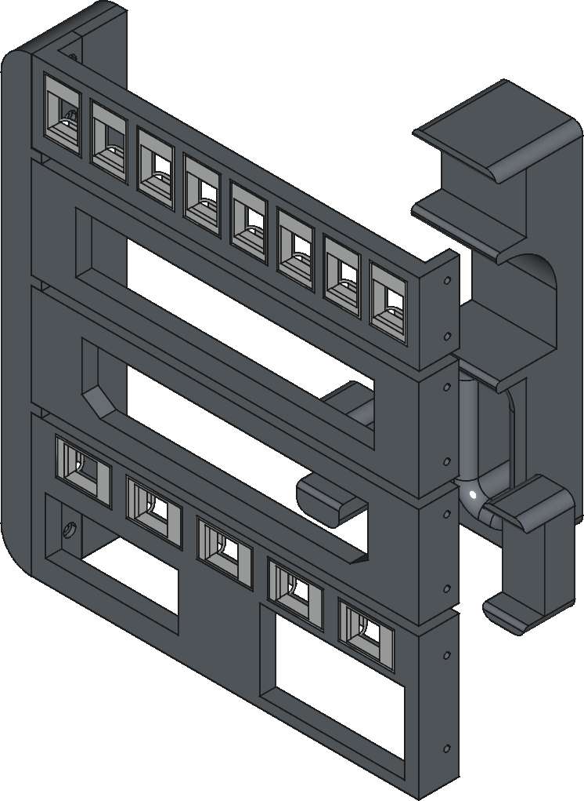

# N2 Mini Rack

3D printed mini rack designed around the shape of a NAS server case,
the [Jonsbo N2](https://www.jonsbo.com/en/products/N2White.html).

Avoid PLA, use high-temperature filament such ABS, PETG or similar.

## Images

## Credits

Thanks to Michael Olsen for their design of the
[Keystone mount](https://www.printables.com/model/236975-keystone-panel-mount),
which was modified for the network patch panel.

Thanks to Mike G for their design of the
[Ubiquiti mini rack](https://www.printables.com/model/300940-ubiquiti-mini-rack),
which this project was inspired by.

## Hardware

- [UniFi Gateway Max](https://store.ui.com/us/en/products/uxg-max)
- [UniFi 8 Port Switch](https://store.ui.com/us/en/products/us-8-60w)
- Raspberry Pi 4 in FLIRC case (8GB RAM)
- Raspberry Pi 5 in Argon NEO 5 NVMe case (8GB RAM, 500GB M.2 SSD)

## Dimensions

| Hardware          | Length (mm) | Width (mm) | Height (mm) |
|-------------------|-------------|------------|-------------|
| Jonsbo N2         |       222.5 |      222.5 |         224 |
| FLIRC (Pi 4)      |          66 |         93 |          28 |
| Argon NEO (Pi 5)  |          95 |         72 |          40 |
| UniFi UXG Max     |       141.8 |      127.6 |          30 |
| UniFi US-8        |         148 |       99.5 |        30.7 |
