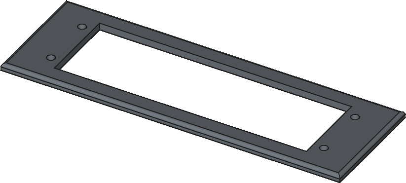

# Patch Panel Faceplate

3D printed faceplate to wall mount a patch panel.

## Images

## Hardware

- [Elqater 8 Port Patch Panel](https://www.amazon.com.au/dp/B0DBQ9YD91)

## Dimensions

| Hardware          | Length (mm) | Width (mm) | Height (mm) |
|-------------------|-------------|------------|-------------|
| Patch Panel       |         145 |         45 |          30 |
| Faceplate         |         165 |         65 |           4 |
